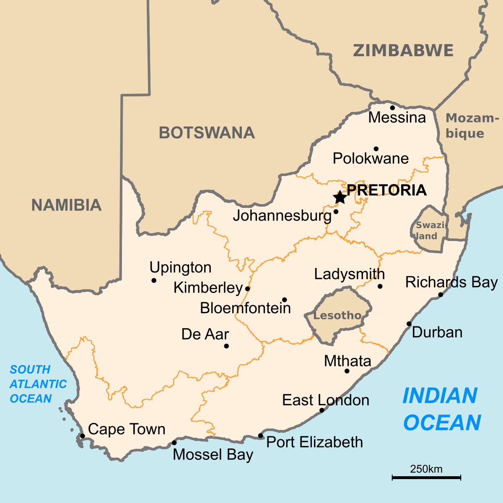

# Introduction

## South Africa: A brief Background

{width="703"}

South Africa is a country on the southernmost tip of Africa. Has an expansive coastline that spans 2,798 kilometres, stretching along the South Atlantic and Indian Oceans. The country is bordered to the north by Namibia, Botswana, and Zimbabwe; and to the east and northeast by Mozambique and Eswatini. Pretoria is the administrative capital, while Cape Town, as the seat of Parliament, is the legislative capital. Bloemfontein has traditionally been regarded as the judicial capital. The largest city, and site of highest court is Johannesburg.

Black South Africans make up around 80% of the population. The greatest populations of European (White South Africans), Asian (Chinese and Indian South Africans), and multiracial (Coloured South Africans) ancestry make up the residual population of Africa. The diverse cultures, languages, and religions that make up South Africa's multiethnic society are numerous.

## Data Source: South Africa Demographic and Health Survey

The South Africa Demographic and Health Survey (DHS) 2016 is part of Phase 7 of the DHS series: a comprehensive, nationally representative household survey series. For the 2016 South Africa DHS, 8,514 women ages 15-49 were successfully interviewed from 11,083 households.

The number of children that a woman bears depends on many factors, including the age at which she begins childbearing, the intervals between her births, and her fecundity. Postponing first births and extending the interval between births have played a role in reducing fertility levels in many Southern African countries, including South Africa. These factors also have positive health consequences. In contrast, short birth intervals (of less than 24 months) can lead to harmful outcomes for both newborns and their mothers, such as preterm birth, low birth weight, and maternal or child death. Childbearing at a very young age is associated with an increased risk of complications during pregnancy and childbirth and higher rates of neonatal mortality. This chapter describes the current level of fertility in South Africa and some of its proximate determinants. It presents information on the total fertility rate, birth intervals, insusceptibility to pregnancy (due to postpartum amenorrhoea, postpartum abstinence, or menopause), age at first birth, and teenage childbearing.

## Capstone Project Objective

The objective of the capstone project is to evaluate perceptions, behaviour and practices around fertility among women aged between 15 and 49 years in South Africa. The data source for this analysis is the *2016 South Africa Demographic and Health Surveys(DHS)*. More info about the survey can be found [here](https://dhsprogram.com/data/Guide-to-DHS-Statistics/).

The data elements selected for this analysis include;

-   *Respondents' age*

-   *Respondents' age at 1st sex*

-   *Respondents' age at 1st birth*

-   *Whether currently pregnant or not*

-   *Region and type of residence*

-   *Highest educational level*

-   *Ethnicity*

-   *Wealth index*

-   *Number children ever born*

-   *Current marital status*

# Data Analysis

Data analysis for this project was carried out in the R version 4.3.2. R is a statistical computing and data visualization programming language. Data mining, bioinformatics, and data analysis are among the fields that have adopted it.

```{r load_packages, include=FALSE}
# Load packages
  #if(!require(pacman)) install.packages("pacman")

# install.packages("devtools")
devtools::install_github("davidsjoberg/ggsankey")

pacman::p_load(
  janitor, # data analysis utilities
  here, # force rmds to use the project folder as working directory
  haven, # for reading in stata files
  tidyverse, # for everything
  gt, # Create beautiful tables
  patchwork # 
   )
```

```{r read_in_dta_file, include=FALSE}
# Reading in the .dta file
ir_sa_raw <- 
  haven::read_dta(here("data/South Africa_IR71DT/ZAIR71FL.DTA"),
                  
                 # Provide a vector of column names
                  col_select = c(
                     v007, # Year of interview
                     v012, # Respondent's current age
                     v013, # Age in 5-year groups
                     v024, # Region
                     v025, # Type of place of residence
                     v045c, # Native language of respondent  
                     v106, # Highest educational level
                     v131, # Ethnicity
                     v190, # Wealth index combined  
                     v201, # Total children ever born
                     v212, # Age of respondent at 1st birth
                     v213, #Currently pregnant
                     v218, # Number of living children
                     v225, # Current pregnancy wanted
                     v501, # Current marital status
                     v525, # Age at first sex
                     v613, # Ideal number of children
                  ))
                  
                  
```

```{r preview_ir_sa_raw, include=FALSE}
# Look at a preview of the raw data frame
  # head(ir_sa_raw)
```

```{r renaming_ir_sa_raw_variables, include=FALSE}
# Renaming the variables
ir_sa_renamed <- 
  ir_sa_raw %>% 
  rename(yr_interview = v007,
         age = v012,
         age_groups = v013,
         region = v024,
         urban_rural = v025,
         native_language = v045c,  
         highest_educ = v106,
         ethnicity = v131,
         wealth_index = v190,  
         num_children_born = v201,
         age_first_birth = v212,
         pregnant_currently = v213,
         num_children_alive = v218,
         pregnant_currently_wanted = v225,
         marital_status = v501,
         age_first_sex = v525,
         num_children_ideal = v613)
```

```{r preview_ir_sa_renamed, include=FALSE}
# Look at a preview of the renamed data frame
  # head(ir_sa_renamed)
```

```{r preview_ir_sa_renamed_variable_data_class, include=FALSE}
# Note the data class of each variable 
  # glimpse(ir_sa_renamed)
```

```{r convert labelled data to regular factors, include=FALSE}
# Convert from labelled data to regular factors 
ir_sa_clean <-    
  ir_sa_renamed %>%    
  haven::as_factor() 
```

```{r preview_ir_sa_cleaned_variable_data_class, include=FALSE}
# Review data classes of the newly converted variables 
  # glimpse(ir_sa_clean)
```

```{r set_global_ggplot_theme, include=FALSE}
# Set global ggplot theme
theme_set(theme_bw())
```

### 1. Pregnancy Status by Education Level Similar for Rural vs Urban Respondents

```{r grouped_bar_chart, echo=FALSE}
# Subset data to have education level ranked.
ir_sa_clean_educ <- 
    ir_sa_clean %>%   
      mutate(highest_educ = factor(highest_educ, levels = c("no education",
                                                            "primary",
                                                            "secondary",
                                                            "higher"))) %>%   
      group_by(pregnant_currently, urban_rural, highest_educ, .drop = FALSE) %>%   
      summarise(number_of_individuals = n(), .groups = 'drop') 


# subset values for use in inline code
num_total_respondents <-  sum(ir_sa_clean_educ$number_of_individuals)

total_respondents_sec <-  filter(ir_sa_clean_educ, 
                              highest_educ == "secondary")

num_total_respondents_sec <- 
  sum(total_respondents_sec$number_of_individuals)

percent_total_sec = paste0(round((num_total_respondents_sec/num_total_respondents)*100),"%")

    # Rural
rural_pregnant <- filter(ir_sa_clean_educ, 
                           urban_rural == "rural" & 
                           pregnant_currently == "yes")
num_rural_pregnant <- 
  sum(rural_pregnant$number_of_individuals)


rural_pregnant_sec <- filter(ir_sa_clean_educ, 
                           urban_rural == "rural" & 
                           pregnant_currently == "yes" &
                           highest_educ == "secondary")
num_rural_pregnant_sec <- 
  sum(rural_pregnant_sec$number_of_individuals)

percent_rural_pregnant_sec = paste0(round((num_rural_pregnant_sec/num_rural_pregnant)*100),"%")

    # Urban
urban_pregnant <- filter(ir_sa_clean_educ, 
                         urban_rural == "urban" & 
                          pregnant_currently == "yes")
num_urban_pregnant <- 
  sum(urban_pregnant$number_of_individuals)


urban_pregnant_sec <- filter(ir_sa_clean_educ, 
                         urban_rural == "urban" & 
                         pregnant_currently == "yes" &
                         highest_educ == "secondary")
num_urban_pregnant_sec <- 
  sum(urban_pregnant_sec$number_of_individuals)

percent_urban_pregnant_sec = paste0(round((num_urban_pregnant_sec/num_urban_pregnant)*100),"%")


# Plot grouped bar graph    
    ggplot(ir_sa_clean_educ,
        aes(x = pregnant_currently,
                   y = number_of_individuals,
                   fill = highest_educ)) +
         
      geom_bar(stat = "identity",
               position = "dodge") +
      facet_grid(~urban_rural) +
      geom_text(aes(x=pregnant_currently,
                    y=number_of_individuals,
                   label=number_of_individuals),
               position = position_dodge(width = 1),
                vjust = - 0.3) +
      scale_y_continuous(breaks = seq(from = 0, to = 4000, by = 1000)) +
      labs(x = "Current Pregrancy Status",
           y = "Number of Respondents",
           title = "Barchart Showing Pregnancy Status by Education Level in Urban vs Rural Areas",
           fill = "Highest Education"
           )
```

**Figure 1.** The total number of respondents in the survey was `r num_total_respondents`. Among them, `r  num_total_respondents_sec` ( `r percent_total_sec`) had secondary school as their highest level of education. . The total number of respondents reporting to be pregnant and living in rural areas was `r num_rural_pregnant`. Of these, `r num_rural_pregnant_sec` (`r percent_rural_pregnant_sec`) have secondary school as their highest level of education. Further, the total number of respondents reporting to be pregnant and living in urban areas was `r num_urban_pregnant`. Of these, `r num_urban_pregnant_sec` (`r percent_urban_pregnant_sec`) have secondary school as their highest level of education.

### 2. Mean Age of Sexual debut differed slightly by Ethnic Group

```{r boxplot_step_1, echo=FALSE}
ir_sa_clean <- 
      filter(ir_sa_clean,
             !(age_first_sex %in% c("at first union",
                                    "inconsistent",
                                    "don't know",
                                    "not had sex")))  

ir_sa_clean$age_first_sex <- as.numeric(ir_sa_clean$age_first_sex)
    

# Calculate means of age_first_sex for each ethnic group for the inline code
ir_sa_clean_ethnicity <- ir_sa_clean %>%
  mutate(ethnicity = case_when(
    ethnicity == "white" ~ "caucasian",
    TRUE ~ ethnicity
  ))

ir_sa_clean_ethnicity <- 
 ir_sa_clean_ethnicity %>%   
      group_by(ethnicity, age_first_sex, .drop = FALSE) %>%   
      summarise(number_of_individuals = n(), .groups = 'drop') 
 


black_ir_sa_clean <- filter(ir_sa_clean_ethnicity, 
                           ethnicity == "black/african")

sum_black_age_first_sex <-  sum(black_ir_sa_clean$number_of_individuals)
 

mean_black_age_first_sex <- 
  round(mean(black_ir_sa_clean$age_first_sex),1)

median_black_age_first_sex <- 
  round(median(black_ir_sa_clean$age_first_sex),1)


coloured_ir_sa_clean <- filter(ir_sa_clean_ethnicity, 
                           ethnicity == "coloured")

sum_coloured_age_first_sex <-  sum(coloured_ir_sa_clean$number_of_individuals)

mean_coloured_age_first_sex <- 
  round(mean(coloured_ir_sa_clean$age_first_sex),1)

median_coloured_age_first_sex <- 
  round(median(coloured_ir_sa_clean$age_first_sex),1)


indian_asian_ir_sa_clean <- filter(ir_sa_clean_ethnicity, 
                           ethnicity == "indian/asian")

sum_indian_asian_age_first_sex <-  sum(indian_asian_ir_sa_clean$number_of_individuals)

mean_indian_asian_age_first_sex <- 
  round(mean(indian_asian_ir_sa_clean$age_first_sex),1)

median_indian_asian_age_first_sex <- 
  round(median(indian_asian_ir_sa_clean$age_first_sex),1)


white_ir_sa_clean <- filter(ir_sa_clean_ethnicity, 
                           ethnicity == "caucasian")

sum_white_age_first_sex <-  sum(white_ir_sa_clean$number_of_individuals)

mean_white_age_first_sex <- 
  round(mean(white_ir_sa_clean$age_first_sex),1)

median_white_age_first_sex <- 
  round(median(white_ir_sa_clean$age_first_sex),1)


other_ir_sa_clean <- filter(ir_sa_clean_ethnicity, 
                           ethnicity == "other")

sum_other_age_first_sex <-  sum(white_ir_sa_clean$number_of_individuals)

mean_other_age_first_sex <- 
  round(mean(other_ir_sa_clean$age_first_sex),1)

median_other_age_first_sex <- 
  round(median(other_ir_sa_clean$age_first_sex),1)

```

```{r boxplot_step_2, echo=FALSE, warning=FALSE}
# Calculate aggregate mean values by  each ethnic group 
means <- aggregate(age_first_sex ~ ethnicity, ir_sa_clean_ethnicity, function(x) round(mean(x), 1))
 
medians <- aggregate(age_first_sex ~ ethnicity, ir_sa_clean_ethnicity, function(x) round(median(x), 1))

 # Plot box plot
mean_ethnicity_boxplot <- 
  ggplot(ir_sa_clean_ethnicity,         
         aes(x = age_first_sex,             
             y = reorder(ethnicity, age_first_sex),             
             fill = ethnicity,
             color = ethnicity)) + 
  geom_boxplot() + 
  geom_jitter(width = 0.25,             
              alpha = 0.5) +
  stat_summary(fun = "mean",
               geom = "point",
               size = 3,
               shape = 23,
               fill = "whitesmoke") +
   geom_text(data = means, 
             aes(x = age_first_sex, 
                 y = reorder(ethnicity, age_first_sex),
                 label = age_first_sex), 
             nudge_x = 1,
             color = "black") +
   labs(x = "Age First Sex",
        y = "Ethnicity",
        title = "Mean Age of Sexual Debut") +
   theme(legend.position = "none",
          axis.title.x = element_blank(),
          axis.title.y = element_blank())  


median_ethnicity_boxplot <- 
  ggplot(ir_sa_clean_ethnicity,         
         aes(x = age_first_sex,             
             y = reorder(ethnicity, age_first_sex),             
             fill = ethnicity)) + 
  geom_boxplot() + 
  geom_jitter(width = 0.25,             
              alpha = 0.4) +
  stat_summary(fun = "median",
               geom = "point",
               size = 3,
               shape = 9,
               fill = "whitesmoke") +
  geom_text(data = medians, 
             aes(x = age_first_sex, 
                 y = reorder(ethnicity, age_first_sex),
                 label = age_first_sex), 
             nudge_x = 1,
             color = "white") +
   labs(x = "Age First Sex",
        y = "Ethnicity",
        title = "Median Age of Sexual Debut") +
   theme(legend.position = "none",
          axis.title.x = element_blank(),
          axis.title.y = element_blank())  

combined_mean_median_boxplot <- 
          mean_ethnicity_boxplot + median_ethnicity_boxplot

combined_mean_median_boxplot
```

**Figure 2.** Among the respondents of the survey by ethnic group who had had sexual intercourse, Coloured respondents were, `r sum_coloured_age_first_sex` and had a mean and median sexual debut of `r mean_coloured_age_first_sex` and `r median_coloured_age_first_sex` respectively. Indian/Asian respondents were, `r sum_indian_asian_age_first_sex` and had a mean and median sexual debut of `r mean_indian_asian_age_first_sex` and `r median_indian_asian_age_first_sex` respectively. Black/African respondents were, `r sum_black_age_first_sex` and had a mean and median sexual debut of `r mean_black_age_first_sex` and `r median_black_age_first_sex` respectively. White/Caucasian respondents were, `r sum_white_age_first_sex` and had a mean and median sexual debut of `r mean_white_age_first_sex` and `r median_white_age_first_sex` respectively. Those categorized as "other" were, `r sum_other_age_first_sex` and had a mean and median sexual debut of `r mean_other_age_first_sex` and `r median_other_age_first_sex` respectively.

### 3. Mean Age of Respondents at First Birth Was Comparable by Region

```{r gt_table_step_1, echo=FALSE}
# Filtering for ages 9 and above
ir_sa_clean <- 
  ir_sa_clean %>% 
    filter(age_first_birth >= 9)

# Create table with summary statistics
ir_sa_clean_summ <- 
  ir_sa_clean %>% 
    summarise(Min = min(age_first_birth, na.rm = TRUE),
              Mean = mean(age_first_birth, na.rm = TRUE),
              Max = max(age_first_birth, na.rm = TRUE), 
              .by = "region"
)

```

```{r gt_table_step_2, echo=FALSE}
# Create basic gt table
ir_sa_clean_gt <- 
  ir_sa_clean_summ %>% 
  gt() %>% 
  
# Creating table that spans across entire table except "region" column
  tab_spanner(
    label = md("**Table Showing Age of Respondents at First Birth by Province**"),
    columns = -region
  ) %>% 
  cols_label_with(fn = str_to_title) %>% # Converts Column titles to Sentence case
  fmt_number(decimals = 2) %>% 
  cols_align("left", columns = region)
```

```{r gt_table_step_3, echo=FALSE}
# First create a violin plot for one region "gauteng"
gauteng_ir_sa_clean <- 
  ir_sa_clean %>% 
    filter(region == "gauteng")

gauteng_ir_sa_clean_plot <- 
  gauteng_ir_sa_clean %>% 
  ggplot(
    aes(x = age_first_birth,
        y = region)) +
  
  geom_violin(fill = "aquamarine4",
              color = "black") +
  theme_void()

```

```{r gt_table_step_4, echo=FALSE}
# Create a function that will apply violin plot above to all regions
plot_violin_region <- function(my_region) {
 gauteng_ir_sa_clean <- 
  ir_sa_clean %>% 
    filter(region == my_region)

gauteng_ir_sa_clean %>% 
  ggplot(
    aes(x = age_first_birth,
        y = region)) +
  
  geom_violin(fill = "aquamarine4",
              color = "black") +
  theme_void() +
  coord_cartesian(
    xlim = range(ir_sa_clean$age_first_birth, na.rm = TRUE)
  )
}


# plot_violin_region("limpopo")
```

```{r gt_table_step_5, echo=FALSE}
# Create final gt_table
ir_sa_clean_summ %>%
    mutate(Distribution = region) %>% 
    gt() %>% 
    tab_spanner(
      label = md("**Figure 3: Table Showing Age of Respondents at First Birth by Province**"),
      columns = -region
    ) %>% 
    cols_label_with(fn = str_to_title) %>% 
    fmt_number(decimals = 2) %>% 
    cols_align("left", columns = region) %>% 
  
# Using text_transform function of gt to great the ggplot images into the gt table  
    text_transform(
      locations = cells_body(columns = "Distribution"),
      fn = function(column) {
        map(column, plot_violin_region) %>% 
          ggplot_image(height = px(50), aspect_ratio = 4)
      }
    ) 

```

The minimum age by region/province of the respondents when they had their first birth ranged from 9 years for Western Cape to 14 years for North West. Whereas the maximum age by region/province of the respondents when they had their first birth ranged from 33 years for Gauteng to 42 years for both Free State and Mpumalanga Provinces. However, mean age at first birth is very comparable across provinces. Ranging from 19.51 years for Mpumalanga to 21.17 years for Free State.

### 4. The Majority of Respondents Have Never been in a Civil Union

```{r sankey diagram, echo=FALSE, warning=FALSE}
library(ggsankey)

ir_sa_clean_sankey <- 
  ir_sa_clean %>% 
    select(age_groups,
           marital_status,
           urban_rural)

TotalCount = nrow(ir_sa_clean_sankey)

# Step 1
df <- ir_sa_clean_sankey %>%
  make_long(age_groups, marital_status, urban_rural)

# Step 2
dagg <- df%>%
  dplyr::group_by(node)%>%
  tally()

dagg <- dagg%>%
  dplyr::group_by(node)%>%
  dplyr::mutate(pct = n/TotalCount)


# Step 3
df2 <- merge(df, dagg, by.x = 'node', by.y = 'node', all.x = TRUE)

pl <- ggplot(df2, aes(x = x
                      , next_x = next_x
                      , node = node
                      , next_node = next_node
                      , fill = factor(node)
                      
                      , label = paste0(node," n=", n, '(',  round(pct* 100,1), '%)' ))
)
 
pl <- pl +geom_sankey(flow.alpha = 0.5,  color = "gray40", show.legend = TRUE)
pl <- pl +geom_sankey_label(size = 3, color = "black", fill= "white", hjust = -0.1)

pl <- pl +  theme_bw()
pl <- pl + theme(legend.position = "none")
pl <- pl +  theme(axis.title = element_blank()
                  , axis.text.y = element_blank()
                  , axis.ticks = element_blank()  
                  , panel.grid = element_blank())
pl <- pl + scale_fill_viridis_d(option = "inferno")
pl <- pl + labs(title = "Comparing Age, Marital Status & Residence Type")
pl <- pl + labs(fill = 'Nodes')
pl


```

**Figure 4.** Looking at the survey respondents disaggregated by age group, marital status and residence type reveals that the majority (48.9%) have never been in a union, followed by those currently married (28%) and those cohabiting with a partner. (14.8%) Those never been in a union are drawn equally from all age groups ranging from 15 to 49. While the vast majority of those currently married are drawn for the older age groups of 30 years and above.

# Conclusion

In summary, fertility varies by residence and province. The majority of women in both urban areas rural areas have at least a secondary education. Furthermore, the mean age of sexual debut differs by ethnic group. Additionally, the distribution of the ages of first birth by region are fairly similar.

## References

1.  [The DHS Program](https://www.dhsprogram.com/)

2.  Giorgi, Federico M.; Ceraolo, Carmine; Mercatelli, Daniele (27 April 2022). ["The R Language: An Engine for Bioinformatics and Data Science"](https://www.ncbi.nlm.nih.gov/pmc/articles/PMC9148156)

3.  [Getty Images](https://www.gettyimages.com/)

{width="686"}
